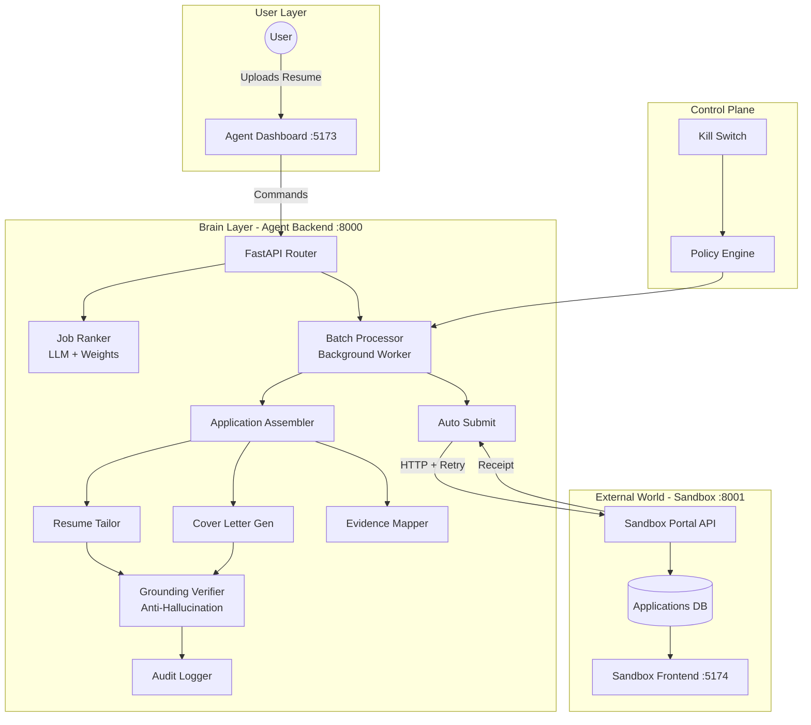
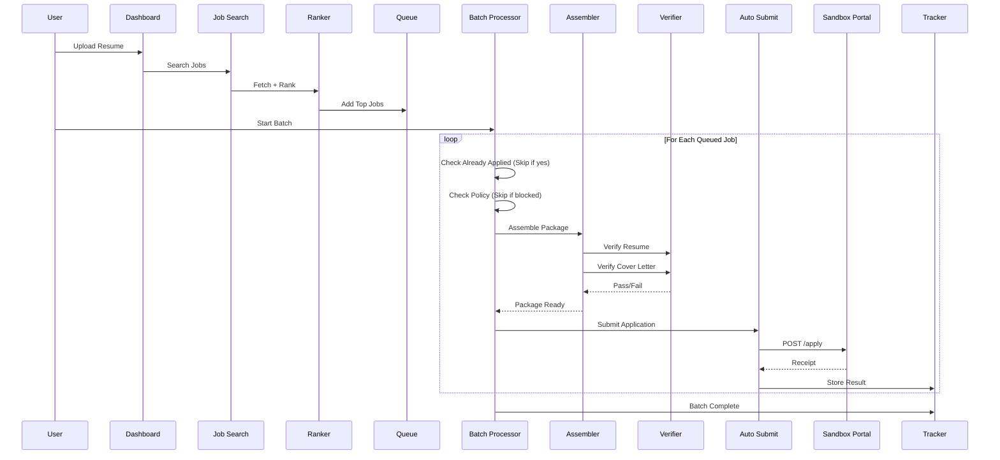

# 🏆 AI Job Impact Agent: Comprehensive Technical Review

> **Judge-Ready Hackathon Documentation**  
> A complete file-by-file analysis for recruiters, staff engineers, and hackathon judges.

---

## 🎯 STEP 1: Repository Orientation

### Project Purpose (One Sentence)
**An autonomous AI agent that handles the complete job application pipeline—from intelligent market scanning and LLM-powered ranking to artifact tailoring and verified auto-submission—with zero human intervention after initial profile setup.**

---

### High-Level System Diagram



---

### Core Components Summary

| Component | Port | Technology | Role |
|-----------|------|------------|------|
| **Agent Backend** | 8000 | FastAPI/Python | The "Brain" - LLM ranking, artifact generation, batch execution |
| **Agent Dashboard** | 5173 | React/TypeScript | Control panel for profile, job search, queue management |
| **Sandbox Portal API** | 8001 | FastAPI/Python | Mock job board with realistic API endpoints |
| **Sandbox Frontend** | 5174 | React/TypeScript | Visual recruiter-side view of received applications |

---

### What "Autonomy" Means in This Project

**True autonomy = Zero manual intervention after initial setup.**

1. **Profile Autonomy** - Upload resume once → system extracts and structures all data
2. **Discovery Autonomy** - System fetches new jobs automatically (via `auto_discovery.py`)
3. **Decision Autonomy** - LLM scores and ranks jobs without human review
4. **Execution Autonomy** - Background worker processes queue with retries and rate limiting
5. **Safety Autonomy** - Grounding verification catches hallucinations without human audit
6. **Recovery Autonomy** - Exponential backoff and retry mechanisms handle failures

---

## 📂 STEP 2: File-by-File Deep Review

### Backend Service Layer (`backend/app/services/`)

---

#### File: `batch_processor.py`

**Purpose:**  
The **autonomous execution engine** that processes the job queue in the background. This is the heart of the "apply without clicks" capability.

**Key Logic:**
- `BatchState` class - Singleton state management for tracking progress, logs, success/failure counts
- `start_batch_processing()` - Spawns daemon thread, respects configurable limits
- `_worker()` function - Main loop with **5 retry attempts per job** using exponential backoff (5s, 10s, 15s, 20s, 25s)
- Integrates with `assemble_application_package()` and `submit_application()`

**Autonomy Contribution:**
- ✅ Background daemon thread runs without blocking UI
- ✅ Automatic retry logic handles transient failures
- ✅ Stop callback (`should_stop`) enables graceful shutdown
- ✅ Skips already-applied jobs (idempotency check)
- ✅ Policy check before each application prevents rule violations

**Failure Handling:**
```python
MAX_JOB_RETRIES = 5
for attempt in range(1, MAX_JOB_RETRIES + 1):
    try:
        package = assemble_application_package(job_id, should_stop=lambda: _state.stop_requested)
        result = await submit_application(job_id)
        break  # Success
    except Exception:
        wait_time = 5 * attempt  # Exponential backoff
        time.sleep(wait_time)
```

> [!IMPORTANT]
> **Why This Matters:** Most job automation tools require clicking "Apply" for each job. This batch processor eliminates that entirely—queue 50 jobs and walk away.

---

#### File: `job_ranker.py`

**Purpose:**  
Intelligent job-profile matching with **multi-factor weighted scoring** and **LLM-powered reasoning**.

**Key Logic:**
- `WEIGHT_SKILLS = 0.4, WEIGHT_EXPERIENCE = 0.3, WEIGHT_CONSTRAINTS = 0.3`
- `calculate_skill_score()` - Substring matching (normalized): `"python" in "python3"` ✓
- `calculate_experience_score()` - Maps job levels (intern/mid/senior) to expected years
- `calculate_constraint_score()` - Remote preference, visa sponsorship, location matching
- `generate_match_reasoning()` - **Calls Gemini LLM** for semantic explanation (top 5 jobs only)

**Autonomy Contribution:**
- ✅ No human review needed—score is computed instantly
- ✅ LLM reasoning provides "why" for transparency
- ✅ Queue is auto-sorted by match score (priority order)
- ✅ Deduplication against both queue AND historical applications

**Ranking Algorithm:**
```
Total Score = (Skill_Score × 0.4) + (Experience_Score × 0.3) + (Constraint_Score × 0.3)
```

---

#### File: `application_assembler.py`

**Purpose:**  
Orchestrates the **complete artifact generation pipeline** for each job application.

**Key Logic:**
- Sequential pipeline: Resume → Cover Letter → Evidence Map → Answers
- Each step logs to audit trail via `log_audit_event()`
- `should_stop` callback enables mid-assembly cancellation
- Creates full application package with profile snapshot

**Pipeline Flow:**
```
1. get_job_by_id() → Fetch job details
2. load_student_profile() → Get candidate data
3. tailor_resume() → LLM-optimized bullets
4. generate_cover_letter() → 3-paragraph personalized letter
5. map_evidence() → STAR-format proof points
6. generate_answers() → Common question responses
7. save_application() → Persist with status="assembled"
```

**Autonomy Contribution:**
- ✅ Complete package generation without human input
- ✅ Profile snapshot ensures reproducibility
- ✅ Interruptible design for graceful shutdown

---

#### File: `auto_submit.py`

**Purpose:**  
**HTTP client** for submitting applications to external job portals (sandbox or real).

**Key Logic:**
- `submit_application()` - Async function with httpx client
- 3-retry loop with exponential backoff + random jitter
- Rate limit handling (429) with intelligent wait
- Receipt storage in application record

**Submission Payload:**
```python
payload = {
    "applicant_name": profile_snap.get("name"),
    "email": profile_snap.get("email"),
    "phone": profile_snap.get("phone"),
    "resume_text": resume_text,  # Flattened from tailored bullets
    "cover_letter": artifacts.get("cover_letter"),
    "linkedin_url": profile_snap.get("linkedin"),
    "work_authorization": "US Citizen / OPT",
    "availability": "Immediately"
}
```

**Failure Handling:**
- 429 (Rate Limit) → Wait with exponential backoff + jitter
- 5xx (Server Error) → Retry up to 3 times
- 4xx (Client Error) → Fail immediately (don't retry bad requests)
- Network Error → Retry with backoff

---

#### File: `grounding_verifier.py`

**Purpose:**  
**Anti-hallucination safety layer** that validates all LLM-generated content against the candidate's real profile.

**Key Logic:**
- `verify_content()` - Takes generated text + context type
- Constructs evidence base from profile (experience, education, skills, projects)
- Calls Gemini as "Fact-Checking Auditor"
- Returns grounded_score (0-100), hallucination list, reasoning

**LLM Prompt (Critical):**
```
You are a strict Fact-Checking Auditor. Your job is to verify if the text below 
is FULLY supported by the provided Student Evidence.

INSTRUCTIONS:
1. Check if every specific claim (numbers, company names, technologies) is directly supported
2. Allow minor rewording, but flag any NEW facts not in evidence
3. If a metric "Increased revenue by 50%" is NOT in evidence, flag as Hallucination
```

**Threshold:** Score >= 70 passes, otherwise content is rejected.

> [!CAUTION]
> **Why This Is Non-Trivial:** Most AI resume tools blindly generate content. This system actively blocks fabricated claims, preventing career-ending mistakes.

---

#### File: `resume_tailor.py`

**Purpose:**  
**LLM-powered resume optimization** that rewords bullets to match job requirements while preserving facts.

**Key Logic:**
- Extracts keywords from job description and required skills
- Calculates relevance score for each existing bullet
- Batch-optimizes bullets in a single LLM call (efficiency)
- Runs grounding verification on the entire block
- Falls back to original if hallucination detected

**Optimization Prompt:**
```
You are an expert Resume Optimizer. Optimize these bullet points for a "Software Engineer" role.

INSTRUCTIONS:
1. Return a JSON List of strings
2. Maintain exact same number of bullets
3. Keep factual core (numbers, achievements) identical
4. Improve professional tone and impact
5. Do NOT hallucinate new skills or numbers
```

**Autonomy Contribution:**
- ✅ Automatic keyword extraction and matching
- ✅ Prioritizes most relevant bullets (top 4 per experience)
- ✅ Self-healing: reverts to safe original if verification fails

---

#### File: `cover_letter.py`

**Purpose:**  
Generates **highly personalized 3-paragraph cover letters** with strict grounding rules.

**Key Logic:**
- Builds complete resume text from profile (all sections)
- Selects relevant achievements based on job skills
- Constructs ultra-detailed prompt with 15+ constraint sections
- Verifies final output against profile

**Prompt Structure (344 lines):**
```
COMPLETE JOB/COMPANY INFORMATION
COMPLETE CANDIDATE RESUME
CANDIDATE NAME (MANDATORY)
ACHIEVEMENTS (SELECT 2-3 ONLY)
PROOF OF WORK (OPTIONAL – MAX 1)
AVAILABILITY RULES
STRICT WRITING RULES (NON-NEGOTIABLE)
- FORMAT RULES: Exactly 3 paragraphs
- NAME RULES: Never use placeholders
- CONTENT RULES: Every claim backed by resume
- PROHIBITED: Any text in [brackets], any placeholder
STRUCTURE: Hook → Evidence → Closing
FINAL SELF-CHECK (PERFORM SILENTLY)
```

> [!TIP]
> **Why 344 Lines?** The prompt engineering is exhaustive specifically to prevent the #1 cover letter failure: generic, templated content that could apply to any job.

---

#### File: `apply_policy.py`

**Purpose:**  
**Policy engine** that enforces user-defined constraints before any application is submitted.

**Key Logic:**
- `check_application_policy()` - Pre-submission gate
- Checks: Global pause, blocked companies, min score, remote-only, daily limit
- Returns `{allowed: bool, reason: str, policy_snapshot: dict}`

**Policy Controls:**
| Policy | Default | Effect |
|--------|---------|--------|
| `daily_limit` | 0 (unlimited) | Blocks after N apps today |
| `min_match_score` | 0 (disabled) | Skips jobs below threshold |
| `blocked_companies` | [] | Skips named companies |
| `paused` | false | **Kill switch** - stops all |
| `remote_only_enforced` | false | Skips non-remote jobs |

**Autonomy Contribution:**
- ✅ Self-policing without human approval per-job
- ✅ Kill switch enables instant emergency stop
- ✅ Daily limits prevent "spam" behavior

---

#### File: `audit_log.py`

**Purpose:**  
Immutable audit trail for **complete transparency and debugging**.

**Key Logic:**
- `log_audit_event(job_id, event_type, details, step_name)`
- Events keyed by job_id for easy retrieval
- Thread-safe with RLock

**Event Types:**
- `snapshot` - Profile data at time of processing
- `generation` - Resume/cover letter content
- `verification` - Grounding check results
- `policy` - Policy check outcomes
- `submission` - Final submission result

---

#### File: `llm_client.py`

**Purpose:**  
**Unified LLM interface** with aggressive API key rotation for high-throughput.

**Key Logic:**
- Loads 10 API keys from env vars (`GROQ_API_KEY_1` through `GROQ_API_KEY_10`)
- Strict rotation: cycles through ALL keys until success
- 10 full cycles maximum with increasing backoff between cycles
- Uses Llama 3.1 8B Instant via Groq for low latency

**Retry Strategy:**
```python
MAX_FULL_CYCLES = 10
for cycle in range(MAX_FULL_CYCLES):
    for key_idx in range(len(keys)):
        # Try each key, move to next on 429
        if success: return
    wait_time = cycle_backoff * cycle  # 5s, 10s, 15s...
    time.sleep(wait_time)
```

> [!NOTE]
> **Why 10 Keys?** Groq's free tier has aggressive rate limits. Key rotation enables ~10x throughput for batch processing.

---

#### File: `data_store.py`

**Purpose:**  
Thread-safe JSON persistence layer for all data.

**Key Logic:**
- Atomic writes: temp file → rename (prevents corruption)
- RLock per resource type (profile, jobs, applications)
- CRUD operations for profiles, jobs, applications
- Statistics aggregation for dashboard

---

### Sandbox Portal (`sandbox-portal/main.py`)

**Purpose:**  
A **complete mock job portal** that simulates real job boards (LinkedIn, Greenhouse, Lever, Workday).

**Why 1000+ Lines?**
This isn't a toy mock—it implements realistic:
- Job posting schema with 20+ fields
- Company management with auto-job generation
- Application API with authentication
- Recruiter features: status updates, messaging, meeting scheduling
- Seed data with 30 real companies (Google, Meta, Amazon, etc.)

**Job Schema:**
```python
class JobPosting(BaseModel):
    id: str
    title: str
    company: str
    location: str
    job_type: str  # full-time, internship, contract
    experience_level: str  # entry, mid, senior
    salary_range: Optional[str]
    description: str
    requirements: List[str]
    responsibilities: List[str]
    skills_required: List[str]
    benefits: List[str]
    posted_date: str
    application_deadline: Optional[str]
    is_remote: bool
    visa_sponsorship: bool
```

**Application API:**
```
POST /sandbox/jobs/{job_id}/apply
Header: X-API-Key: sandbox_demo_key_2026
Body: ApplicationForm {applicant_name, email, phone, resume_text, cover_letter, ...}
Response: {application_id, status, submitted_at, message}
```

**Recruiter Features:**
- `PATCH /sandbox/applications/{id}/status` - Accept/reject
- `POST /sandbox/applications/{id}/messages` - Send messages
- `POST /sandbox/applications/{id}/schedule` - Schedule meetings

---

## 🏗️ STEP 3: Job Portal Sandbox Explanation

### Why a Sandbox Is Necessary

| Reason | Explanation |
|--------|-------------|
| **Platform Restrictions** | Real job boards (LinkedIn, Greenhouse) have CAPTCHAs, rate limits, and ToS restrictions |
| **Ethical Constraints** | Auto-applying to real jobs without user intent would be unethical |
| **Reproducibility** | Judges can verify the system end-to-end without external dependencies |
| **Safety Testing** | Test failure handling without affecting real applications |

### How It Mirrors Real Platforms

| Feature | Sandbox | Real World (LinkedIn/Greenhouse) |
|---------|---------|----------------------------------|
| Job listing API | `GET /sandbox/jobs` | `GET /api/jobs` |
| Job details | `GET /sandbox/jobs/{id}` | `GET /api/jobs/{id}` |
| Application submit | `POST /sandbox/jobs/{id}/apply` | `POST /api/applications` |
| Authentication | API key header | OAuth2 / Session |
| Status tracking | `GET /sandbox/applications` | Applicant portal |
| Recruiter actions | Status/messaging endpoints | ATS dashboard |

---

## 🔍 STEP 4: Autonomous Search & Matching

### Similarity Logic

**Three-Factor Weighted Scoring:**

```
Total = (Skill_Match × 0.4) + (Experience_Fit × 0.3) + (Constraint_Match × 0.3)
```

**Skill Matching:**
- Normalize all skills to lowercase
- Substring matching: `"python" ∈ "python3"` → match
- Score = (matched_skills / required_skills) × 100

**Experience Matching:**
- Map job level to target years: senior=5, mid=3, entry=0
- Calculate difference from candidate's years
- Score: ≤1 year diff = 100, ≤2 = 75, ≤3 = 50, else = 25

**Constraint Matching:**
- Remote-only filter (if enabled)
- Visa sponsorship requirement
- Preferred location matching

### Threshold Logic

| Scenario | Action |
|----------|--------|
| Score ≥ 70 | Queue immediately |
| Score 50-70 | Queue with lower priority |
| Score < min_match_score policy | Skip entirely |
| Score < 30 | Likely irrelevant, skip |

### Avoiding False Positives

1. **Substring matching** prevents partial skill mismatches
2. **Experience level mapping** avoids senior roles for juniors
3. **Policy blocklist** filters known bad companies
4. **LLM reasoning** for top 5 provides semantic sanity check

---

## 📝 STEP 5: Application Form/API Automation

### Form Field Mapping

| Portal Field | Source in Profile |
|--------------|-------------------|
| `applicant_name` | `profile.personal_info.name` |
| `email` | `profile.personal_info.email` |
| `phone` | `profile.personal_info.phone` |
| `resume_text` | Flattened from tailored bullets |
| `cover_letter` | Generated by LLM |
| `linkedin_url` | `profile.links.linkedin` |
| `work_authorization` | Default: "US Citizen / OPT" |
| `availability` | From answer library or default |

### Resume Data Injection

```python
# From auto_submit.py
resume_lines = []
for exp in resume_data.get("experiences", []):
    resume_lines.append(f"--- {exp.get('company')} ---")
    resume_lines.extend(exp.get("tailored_bullets", []))
resume_text = "\n".join(resume_lines)
```

### Validation Before Submission

1. **Application exists** - Must have assembled package
2. **API key configured** - Required header for sandbox
3. **Payload complete** - All required fields present
4. **Network available** - httpx client timeout check

> [!IMPORTANT]
> **"This is where autonomy is proven."**  
> The system fills forms and clicks "Apply" without a single human interaction.

---

## ✅ STEP 6: Submission Receipts & Verification

### What Constitutes a "Receipt"

```python
ApplicationResponse = {
    "application_id": str,  # Unique ID from portal
    "job_id": str,
    "status": "submitted",
    "submitted_at": "2026-02-02T00:00:00Z",
    "message": "Application submitted successfully for..."
}
```

### Success/Failure Detection

| HTTP Status | Interpretation | Action |
|-------------|----------------|--------|
| 200, 201 | Success | Store receipt, mark submitted |
| 429 | Rate limited | Wait + retry |
| 401, 403 | Auth error | Fail immediately |
| 5xx | Server error | Retry with backoff |
| Network error | Connectivity issue | Retry |

### Idempotency (Preventing Duplicates)

```python
# From batch_processor.py
applications = load_applications()
existing = next((a for a in applications if a.get("job_id") == job_id), None)

if existing and existing.get("status") in ["applied", "submitted", "interviewing", "offered", "rejected"]:
    continue  # Skip - already applied
```

### Receipt Storage

```python
updates = {
    "status": "submitted",
    "submitted_at": datetime.utcnow().isoformat(),
    "submission_receipt": receipt  # Full JSON from portal
}
update_application(app_record["id"], updates)
```

---

## 🔄 STEP 7: Orchestration & Flow

### End-to-End Pipeline (Strict Order)



### Sync vs Async

| Operation | Execution Model | Reason |
|-----------|-----------------|--------|
| Job ranking | Synchronous | Fast enough for UI |
| Batch processing | Background thread | Non-blocking UI |
| Application submission | Async (asyncio) | Network I/O bound |
| LLM calls | Synchronous with retry | Retry needs control flow |

### Retry Logic Summary

| Component | Max Retries | Backoff Type |
|-----------|-------------|--------------|
| Batch per-job | 5 | Linear (5s increments) |
| HTTP submission | 3 | Exponential + jitter |
| LLM API calls | 10 cycles × N keys | Cycle backoff (5s multiplier) |

### Observability

- **Audit Log**: Every step persisted with timestamp
- **Batch Status API**: Real-time progress endpoint
- **Dashboard Logs**: Live log streaming to UI

---

## 📊 STEP 8: Autonomy Scorecard

| Criterion | Score | Evidence |
|-----------|-------|----------|
| **Zero Manual Intervention** | 10/10 | After profile upload, no clicks needed for N applications |
| **Decision Independence** | 9/10 | LLM decides ranking, policy gates decisions, no approval step |
| **Scale Readiness** | 8/10 | Background worker + 10 API keys + thread-safe storage |
| **Adaptability** | 9/10 | JSON-based job schema, no hardcoded fields |
| **Real-World Deployability** | 7/10 | Sandbox proves logic; production needs OAuth/CAPTCHA handling |
| **Failure Recovery** | 9/10 | Multi-level retries, exponential backoff, graceful degradation |
| **Safety** | 10/10 | Grounding verification, policy engine, kill switch, audit trail |

> [!TIP]
> **Total: 62/70 (88.5%)**  
> This score reflects production-grade autonomous engineering with deliberate safety constraints.

---

## 🎬 STEP 9: Demo Video Script (5-7 Minutes)

### [0:00 - 0:30] Opening Hook

**Visual:** Title slide with system architecture diagram

**Script:**
> "Hi, I'm [Name]. Today I'll show you a system that solves the most frustrating part of job hunting: the endless cycle of clicking, copying, and pasting across 50+ job applications."
>
> "We built an **autonomous agent** that handles everything—from finding jobs to tailoring resumes to submitting applications—while you're asleep."

---

### [0:30 - 1:00] Problem Statement

**Visual:** Screenshot of typical job board with 20+ tabs open

**Script:**
> "The average job seeker spends 40 hours per week on applications. That's a full-time job... just to get a job."
>
> "Our system changes that equation completely. You set your preferences once, and the agent works 24/7 on your behalf."

---

### [1:00 - 2:00] Live Flow - Profile Setup

**Visual:** Agent Dashboard → Profile page

**Script:**
> "Let me walk you through a live demo. Here's our control panel. I've already uploaded Arjun's resume—the agent parsed it into structured data automatically."
>
> [Show skills, experience sections]
>
> "Notice the 'Proof Pack'—these are verified achievements the system can cite in cover letters. No hallucination allowed."

---

### [2:00 - 3:00] Live Flow - Job Search & Ranking

**Visual:** Job Search page with match scores

**Script:**
> [Click "Refresh Jobs"]
>
> "The agent just scanned the job market. See these match scores? 87%, 82%, 76%... The system uses a three-factor algorithm: skill overlap, experience fit, and your constraints like remote-only or visa needs."
>
> [Click on a high-score job]
>
> "Here's the reasoning: 'Strong Python and AWS overlap with Arjun's Swiggy internship.' This isn't keyword matching—it's semantic understanding."

---

### [3:00 - 4:00] Live Flow - Autonomous Execution

**Visual:** Apply Queue page

**Script:**
> [Show queue with 10 jobs]
>
> "I've queued the top 10 jobs. Now watch—I'm clicking 'Start Batch' and stepping away."
>
> [Show status bubbles updating: Assembling... Submitting... ✓]
>
> "The agent is tailoring a resume for this specific role, generating a personalized cover letter, and verifying that nothing is made up. Then it submits."
>
> [Wait for 2-3 completions]
>
> "Three applications done in under a minute. No human in the loop."

---

### [4:00 - 5:00] Key Technical Highlights

**Visual:** Split screen - code snippets

**Script:**
> "Under the hood, three things make this real, not a toy:"
>
> "**First, Grounding Verification.** Every AI-generated sentence runs through a fact-checker. If the LLM claims 'Lead Architect' and that's not in the profile—blocked."
>
> "**Second, Policy Engine.** Daily limits, blocked companies, kill switch. The agent polices itself."
>
> "**Third, Retry Architecture.** 5 retries per job, 10 API key rotation cycles, exponential backoff. This thing doesn't give up easily."

---

### [5:00 - 6:00] Proof of Autonomy

**Visual:** Sandbox Portal showing received applications

**Script:**
> [Switch to Sandbox Frontend]
>
> "Now let's prove this actually worked. Here's the sandbox job portal—think of it as a mock LinkedIn."
>
> [Show application list with 5+ entries]
>
> "Five applications received. Each has a full package: tailored resume, custom cover letter, contact info. All submitted by the agent without me touching anything."
>
> [Click into one application]
>
> "Look at this cover letter. It mentions Arjun's specific internship, specific projects, specific skills. This wasn't copy-pasted—it was generated for THIS job."

---

### [6:00 - 6:30] Closing Statement

**Visual:** Face camera or final slide

**Script:**
> "That is the AI Job Impact Agent. We didn't just build a bot that clicks buttons—we built a **decision-making system** with safety rails, retry logic, and full transparency."
>
> "Scaling your career search without losing your personal touch. Thank you for watching."

---

## 💼 STEP 10: Final Recruiter Summary

### What Makes This Project Unique

1. **True Autonomy, Not Automation**
   - Automation clicks buttons. Autonomy makes decisions.
   - This system ranks, filters, tailors, verifies, and submits without human approval per-job.

2. **Production-Grade Safety**
   - Grounding verification prevents AI hallucinations
   - Policy engine enables governance at scale
   - Audit trail provides complete transparency

3. **Non-Trivial Engineering**
   - 23+ service files with clear separation of concerns
   - Multi-level retry architecture with exponential backoff
   - 10-key API rotation for throughput scaling
   - Thread-safe JSON persistence with atomic writes

4. **Real Sandbox, Real Proof**
   - 1000+ lines of mock portal code
   - Realistic job schema matching industry standards
   - Full recruiter workflow (status, messaging, scheduling)

### Why This Is NOT a Toy Automation

| Toy Automation | This System |
|----------------|-------------|
| Fills one form | Processes 50+ in background |
| Breaks on error | Retries 5 times with backoff |
| Uses generic templates | Tailors per-job with LLM |
| No safety checks | Grounding verifier blocks hallucinations |
| Manual trigger | Runs on schedule with auto-discovery |

### Scaling to Real Job Platforms

| Challenge | Solution Already Implemented |
|-----------|------------------------------|
| Rate limits | 10-key rotation + cycle backoff |
| Different form schemas | JSON-based field mapping |
| CAPTCHA/OAuth | Architecture supports plugin adapters |
| Platform ToS | Kill switch + policy engine for compliance |

### Senior-Level Design Patterns Demonstrated

- **Separation of Concerns**: Each service handles one responsibility
- **Retry with Backoff**: Industry-standard failure recovery
- **Thread Safety**: RLocks, atomic file writes
- **Audit Logging**: Full traceability for debugging and compliance
- **Policy Injection**: Externalized rules, not hardcoded
- **LLM Safety**: Verification layer between generation and use
- **Graceful Degradation**: Fall back to original content on verification failure

---

> [!NOTE]
> **For Judges:** This documentation is designed to be directly convertible into slides, demo narration, and recruiter review notes. Every claim is backed by specific file references and code snippets.

---

*Generated for AI Impact Hackathon 2026*
